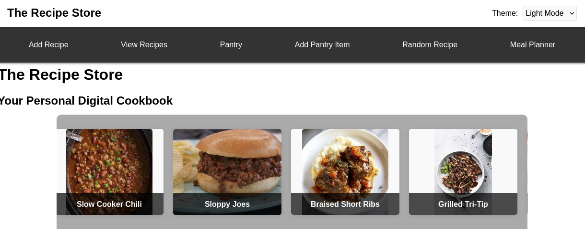
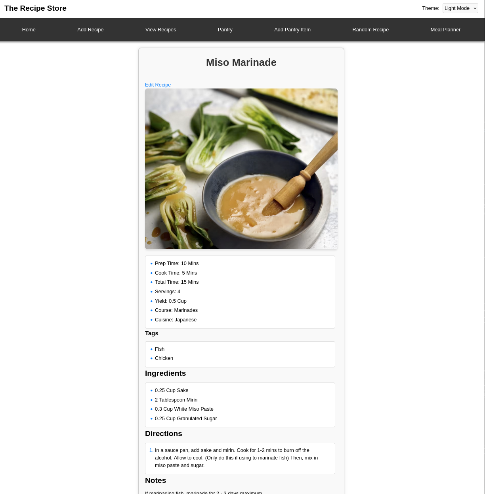
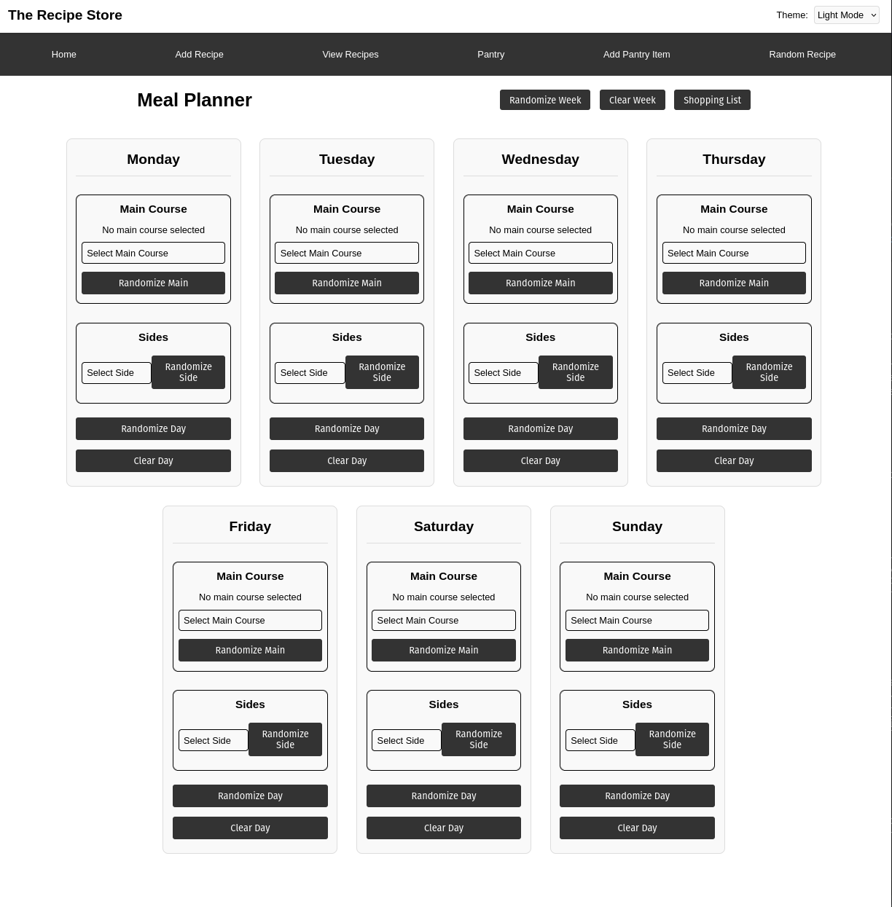
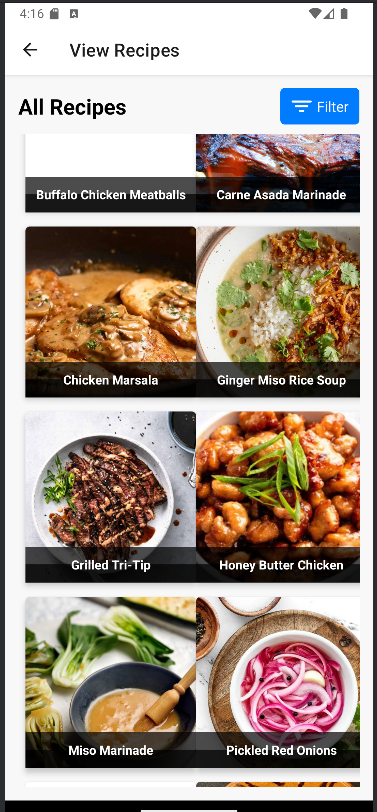
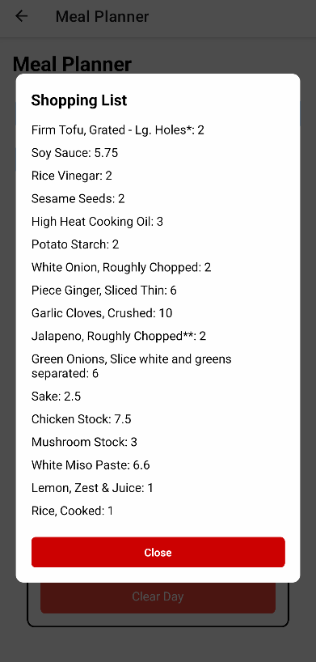
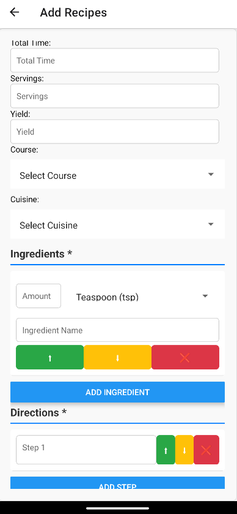

# 🍽️ RecipeApp – Smart Recipe Manager

## Description

**RecipeApp** is a modern cross-platform application designed to help users store, organize, and manage their recipes. It includes a web interface for full-featured recipe management, a mobile app for on-the-go access and meal planning, and a backend API supporting secure storage, user authentication, and data persistence.

---

## Table of Contents

1. [Features](#features)  
2. [Web App](#web-app)  
3. [Mobile App](#mobile-app)  
4. [Backend](#backend)  
5. [Installation](#installation)  
6. [Tech Stack](#tech-stack)  
7. [License](#license)

---

## Features

- Save and edit custom recipes
- Organize ingredients with tags and categories (Future Development)
- Weekly meal planner (Work-In-Progress)
- Dynamic shopping list generator (Work-In-Progress)
- Sync across web and mobile platforms

---

## Screenshots

Below are a few images showcasing different parts of the application in action:

### Web App

| Home Page | Recipe Detail | Meal Planner |
|----------|----------------|--------------|
|  |  |  |

---

### Mobile App

| Recipe List | Shopping List | Add Recipe |
|-------------|----------------|------------|
|  |  |  |

---

## Web App

The web app provides a responsive user interface for managing your recipes and weekly meal plans.

**Key Components:**
- `React + Vite` front end
- Custom components: `RecipeCard`, `DayPlan`, `ShoppingList`
- Integrated with backend via REST
- Responsive CSS and dark/light mode support

**Development Commands:**
```bash
npm install
npm run dev
```

---

## Mobile App

The mobile app is built with **React Native + Expo**, offering a smooth experience for users on iOS and Android.

**Features:**
- Browse saved recipes
- Plan meals for each day
- Generate a shopping list
- Offline access to saved data

**Development Commands:**
```bash
npx create-expo-app
npm start
```

---

## Backend

The backend powers user authentication, recipe storage, and planning logic.

**Built with:**
- Node.js + Express
- MongoDB with Mongoose
- JWT-based user authentication (Future Development)
- REST API

**Endpoints Overview:**
- `POST /auth/login` – User login (Future Development)
- `GET /recipes` – Fetch user recipes
- `POST /mealplan` – Save weekly plan

**Start the Server:**
```bash
npm install
npm run dev
```

---

## Installation

1. Clone the repository
2. Set up `.env` files for backend and frontend
3. Run the backend and frontend servers
4. Install Expo CLI and run the mobile app

---

## Tech Stack

- **Frontend:** React, TypeScript, Vite, CSS
- **Mobile:** React Native, Expo
- **Backend:** Node.js, Express, MongoDB
- **APIs:** REST  
- **Dev Tools:** GitHub Actions, PM2

---

## License

This project is licensed under the [MIT License](LICENSE).